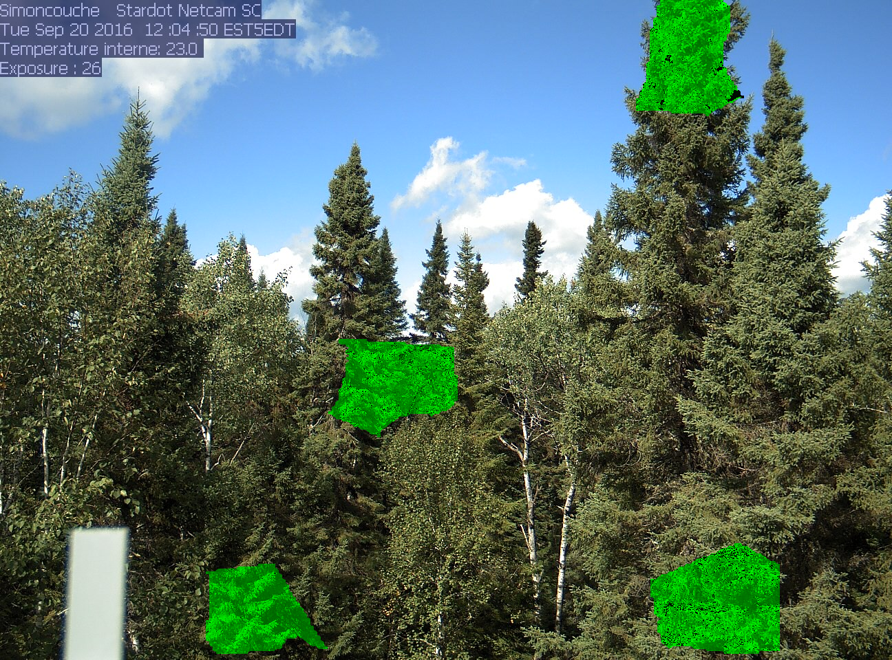

# **How to use 'phenoAI' python Package**
  
(Refer [PhenoAI package functioning.ipynb](PhenoAI%20package%20functioning.ipynb) notebook)

The PhenoAI package can be installed from provided whl file containing the modules of the package by running the following command in an jupyter environment:
```ruby
!pip install phenoAI-0.1-py3-none-any.whl
```

Dependencies: 
```
opencv-python,
tensorflow,
keras,
tqdm,
segmentation_models,
xlsxwriter,
albumentations
imgaug
```
All the required libraries and packages will be automatically installed with installation of PhenoAI.

The PhenoAI is divided in 2 modules. Its documentation is provided below.
## (a)  trainPhenoAI: 
The *\`trainPhenoAI(dataset_path, epochs,learning_rate, batch_size,is_augmentation)*\` function is used to create a segmentation model by training it through an image dataset. 

*\`dataset_path*\` : the location of the dataset containing images and labels. 
Optional Parameters: *\`epochs*\`, *\`learning_rate*\`, *\`batch_size*\`, *\`is_augmentation*\`(True to increase data)

This function has below sub-functions: 
- *\`reTrain(epochs)*\`: For Training the model for more epochs 
- *\`performanceReport()*\`: Gives us loss(or metrics) vs epochs graphs, scores of test data prediction
-	 *\`saveModel(saving_location)*\`: This function saves the trained phenological model. 

``` ruby
from phenoAI import trainPhenoAI
model = trainPhenoAI (dataset_path)
```
```
Saving Image masks of Json labels...|done
Orderwise Classes names:  ['deciduous', 'coniferous']
Loading Dataset images and masks for training...|done
Training the model...
Epoch 1/35
...
```
```ruby
model.reTrain(epochs =5)
model.saveModel(‘my_model.zip’)
```
**for getting performance report**
```ruby
model.performanceReport()
```

```
Test performance:
Loss:  0.1567145701646805
iou : 0.9121432443618774
f1-score : 0.923451619338989
```

## (b) loadModel:

The function *\`loadModel (model, dataset_path, class_name,date_pattern)*\` creates an analysis object for a specific class of trees in the dataset. 

The following are function's arguments:
- *\`model*\`: This is the location of the model zip file obtained from the *\`trainPhenoAI*\` module.
- *\`dataset_path*\`: This is the location of the images for analysis.
- *\`class_name*\`: This is the name of the tree category on which the analysis will be performed. 
- *\`date_pattern*\`: This is used for extracting date from image name. <br>
This should match with image file name. It should contain 'yyyy', 'dd' and 'mm', and '*' charecter. '\*' is used for covering zero aur more consequent characters.<br>
For Example: for file 'Sd-<u>20221204</u>-15_sdg.jpg', pattern can be: '\*yyyymmdd-\*' or '\*-yyyymmdd-\*'.

```ruby
from phenoAI import loadModel
pheno = loadModel (model_path, dataset, vegetation_name, “_*yyyy-mmdd_*”)
```
```
Loading Vegetation segmentation Model...|done
Importing Dataset...|done
Creating ROIs in the vegetation segment...|done
Extracting Chromatic chromatic coordinate from Images...|done
Calculating phenological Parameters...|done
```
The analysis object created by this function includes the following functions:

- *\`showROIs()*\`: This displays the images with selected ROIs.
- *\`extractGCCParameters()*\`: This function extracts the six phenological parameters for GCC.
- *\`plotGCC()*\`: This function plots GCC versus Day of Year (DoY) graph.
- *\`saveGCCPlot(path_location)*\`: This function saves the GCC vs. DoY plot images in the 
- *\`saveCCsTimeSeries(path_location)*\`: This function saves all records of GCC, BCC, RCC, and six phenological parameters in an Excel file at the given location. 


Showing ROIs:
```ruby
pheno.saveROIsImage("ROI_image.jpg")
pheno.showROIs()
```
        

Plotting GCC w.r.t. Day of year:
```ruby
pheno.saveGCCPlot("GCC_plot.jpg")
pheno.plotGCC()
```
         

Phenological Parameters: 
```ruby
min, max, slope1, SoS, slope2, EoS = pheno.extractGCCParameters()
```
```
Maximum GCC: 0.4
Start of season(DoY):  117
End of season:  302
Greenary increasing rate: 0.048
Greenary decreasing rate: 0.036
```
Saving all the record of parameters and chromatic coordinates:
``` ruby
pheno.saveCCsTimeSeries(r"G:\packege testing")
```
 
